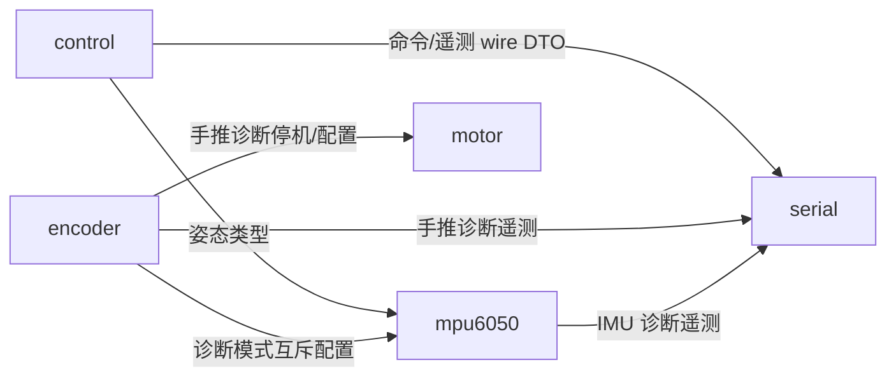

# F411 模块解耦与平台无关性审查

> 重构前快照。本文列出的八组边界已在后续工作流处理，当前结构和验收见 [ARCHITECTURE_REFACTOR_20261007.md](ARCHITECTURE_REFACTOR_20261007.md)。本报告的旧路径/行号保留为历史证据。

日期：2026-10-07。对象：当前工作区源码，包含前几轮静态修复及 EncoderTest 的未提交改动。

**结论：算法核心已经有较好的独立性，但模块目录尚未形成可独立构建的完整边界。任务调度、通信格式、应用装配和硬件后端仍有混合。** 不能用“所有模块都耦合”或“测试通过就平台无关”描述当前状态。

本轮按用户要求以 4 路并发执行：主代理负责清单、统计与汇总；另外 3 路分别审查模块依赖、平台移植性、接口/构建/测试边界。仅新增审查脚本与文档，没有修改固件、测试或构建配置，没有烧录、连接实车或执行重构。

## 1. 统计口径

- 粗粒度模块：`Core` 加 `middleware` 下的 `control`、`encoder`、`motor`、`mpu6050`、`serial`，共 **6 个**。
- 自有固件清单：上述目录的 **27 个 C 文件、29 个头文件**。27 个 C 文件均在当前 Debug 编译数据库中，诊断源文件也计入；参与编译不代表每种固件都把它们保留到最终 ELF。
- 平台分类和行数仅统计这 27 个 C 文件。排除 HAL/CMSIS、FreeRTOS、Fusion/LibDriver/LwPKT/LwRB 第三方源码、工具脚本、测试、构建产物；`Core/system_stm32f4xx.c` 等板级基础设施保留但单列。
- 物理行包括注释与空行。辅助“非注释行”去掉空行/注释，仍包含声明与预处理指令，不等同机器指令或纯执行语句。
- 分类按整份实现是否能脱离依赖而成立。**“平台相关文件有 N 行”不表示其中每一行需要重写。** 不使用字符串匹配命中数冒充真实耦合行数。
- include 图按当前 C/H 中所有条件分支的直接跨模块 include 统计，同方向多处引用合并成一条边；没有把传递 include、函数调用和包含次数重复加到边数里。

## 2. 多少代码不是完全平台无关

| 实现类别 | C 文件数 | 物理行 | 非空非注释行 | 含义 |
| --- | ---: | ---: | ---: | --- |
| 纯 C/标准库，允许明确的可移植算法库依赖 | **3** | **1435** | 1165 | controller、FSM、Fusion 解算包装 |
| STM32 无关，但依赖 FreeRTOS/工具链约定 | **4** | **640** | 591 | 控制与 IMU 的任务实现 |
| 直接依赖 STM32 HAL/寄存器/引脚 | **17** | **2266** | 1790 | 板级外设、应用集成、设备后端及诊断 |
| 目标运行库/厂商启动基础设施 | **3** | **1078** | 537 | syscalls、sysmem、system_stm32f4xx |
| **合计** | **27** | **5419** | **4083** | 不含头文件行数及第三方实现 |

严格按“脱离 MCU 和 RTOS 仍能使用”的标准：**24/27 个文件不是完全平台无关**，相关文件合计 **3984/5419 物理行，73.5%**。按去注释的辅助口径，相关文件为 2918/4083 行，约 71.5%；这些仍是文件规模比例，不是必须改写的语句比例。

如果只关心自行维护的业务中间层，排除 Core：

| middleware 分类 | 文件数 | 物理行 |
| --- | ---: | ---: |
| 纯 C/可移植算法 | 3 | 1435 |
| 依赖 FreeRTOS | 4 | 640 |
| 直接依赖硬件 | 6 | 814 |
| **合计** | **13** | **2889** |

因此 middleware 内有 **10/13 个实现尚未完全平台无关**，相关文件合计 **1454 行（50.3%）**。其中 **6 个文件直接绑定 STM32**，4 个文件保留同一 RTOS 时较容易跨 MCU 复用。

这比全工程比例更能体现应用架构：Core 本来就有初始化、中断、链接和运行库职责，不应为了追求统计比例强行抽象成“通用 C”。另外 `startup_stm32f411xe.s`、`STM32F411XX_FLASH.ld`、ARM toolchain 和 `.ioc` 也与平台有关，但未混算到上述 C 行数。

### 三个已独立的核心

1. `middleware/control/src/balance_controller.c`：579 行。
2. `middleware/control/src/safety_fsm.c`：559 行，时间由调用者输入。
3. `middleware/mpu6050/src/imu_fusion.c`：297 行，依赖可移植 Fusion 算法库，**不依赖 STM32/RTOS**。

审查代理已对三者使用 MinGW GCC `-std=c11 -pedantic-errors -Wall -Wextra -Werror -fsyntax-only`，只提供自身与 Fusion 头目录，没有 HAL、RTOS 或测试 stub，全部通过；进一步核对真实 ARM 编译参数的 `-MM` 依赖。

当前 `imu_port.h` 只包含 `stdint.h`，`motor_driver.h` 和 `encoder_driver.h` 也只暴露标准类型，**没有 HAL 头污染**。Fusion 具体类型的外露是算法库耦合，应与硬件平台耦合区分。

## 3. 模块之间有多少依赖

- **28 处**跨模块 include，归并为 **15 条有向模块依赖边**。
- 排除 Core 后，5 个 middleware 之间有 **6 条有向边**，**0 个 include 循环**。
- 5 个 middleware 目前 **0/5 有独立的模块 CMake target**。它们共享大范围 include 与定义，因此边界主要靠开发约定，而非构建器强制。
- 另有 **1 组隐藏的 weak/strong 符号绑定**，不会出现在 include 图里。

这些数字回答不同的问题：15 条依赖不是 15 个缺陷；“没有循环”也不等于实现、协议和平台已经充分隔离。

### middleware 之间的全部六条直接 include 关系



`encoder → mpu6050` 仅来自 `encoder_push_test_task.h:6` 的配置互斥，不是编码器驱动需要 IMU 数据。`encoder → motor/serial` 也主要是整车诊断工作流放在设备目录的结果。

Core 向五个 middleware 都有装配依赖，encoder/motor/mpu6050/serial 又依赖 Core 中的外设头。合入 Core 目录节点后出现一个包含六模块的强连通分量，主要因为 **应用装配和硬件后端混放在 Core**。应拆清职责，不能据此指责所有业务模块互相调用失控。

| 模块 | 当前边界判断 |
| --- | --- |
| control | 两个算法核心已隔离；balance_task 仍混合 RTOS、协议格式、传感器具体类型 |
| encoder | 公开驱动 API 无 HAL；实现固定 TIM2/TIM5，通用计数逻辑和寄存器读取混合；手推诊断引入多个模块 |
| motor | 公开 API 无 HAL；实现固定 TIM1/PA8～PA11/Cortex-M；另有对 control hook 名称的隐式强符号契约 |
| mpu6050 | imu_port 边界存在，解算独立；I2C 后端固定 hi2c1，任务依赖 RTOS，公共头外露 Fusion 类型 |
| serial | UART DMA 后端绑定 huart2；协议服务的实际实现还在 Core/app_freertos，而非 serial 模块内 |
| Core | 初始化/中断的平台依赖合理；app_freertos 同时承担装配、协议、命令路由、LED 和故障钩子，职责过多 |

## 4. 按根因归并的八组待重构边界

以下为架构改进优先级，不代表在当前 1000Hz、小端 ARM 配置下全部存在运行错误。

### A1 / 高：构建系统没有强制模块边界

`cmake/stm32cubemx/CMakeLists.txt:12` 将全部平台、RTOS、设备、算法头目录汇总；`:106-118` 通过 stm32cubemx INTERFACE 发布并把源码加入同一个 executable。自有五个模块没有独立 target。

建议先给已有纯核心建立 `balance_core`、`safety_core`、`imu_fusion` 独立库，精确区分 PUBLIC/PRIVATE include。宿主测试链接同一核心目标，平台/RTOS 适配单独构建。这样越层引用会尽早在编译阶段暴露。

### A2 / 高：协议服务与整车装配混在 app_freertos.c

`Core/Src/app_freertos.c` 共 **546 行**，包含任务/队列初始化、协议收包、命令路由、发送、LED 和故障钩子。`serial_protocol.h` 声明的 send/try_send/get_stats，实际定义位于该文件 `:419/:424/:429`。

复用 serial 模块不能只链接 serial 目录，需要拖入应用代码。应拆为协议服务、应用命令适配器、组合根和板级故障/指示入口。`app_freertos.h:23-28` 另公开了六个队列句柄，可收为私有；**当前未发现其他模块直接按这些全局名字访问它们**，这不是已经发生的六路共享全局滥用。

### A3 / 高：控制服务直接理解通信格式与 RTOS 搬运

`balance_task.h:19-26` 同时引入 RTOS、serial_protocol 和 imu_fusion。`balance_task.c:133` 起直接校验协议版本、转换 Q16.16；`:148` 和 `:160` 处理线上命令结构；`:259-271` 直接打包并发送 telemetry。

建议抽出纯 C 的 `balance_runtime_step(ctx, now_ms, attitude, wheels, commands, outputs)`。领域命令不携带线上 version/Q16 格式；协议 adapter 做解码，RTOS adapter 做调度与队列，遥测服务读取快照。停止请求的立即性和优先级必须保留。

### A4 / 中：姿态公共契约暴露 Fusion 实现类型

`imu_fusion.h:6-8` 引入 FusionAhrs/Bias/Remap，`:24` 暴露 Fusion 内部状态，`:46` 的输出使用 FusionQuaternion。控制消费者包含同一个头，替换姿态算法会影响其编译依赖。

应拆出只有标准数值类型的 `attitude_sample_t`，把 Fusion 私有状态留在适配模块。姿态输入依赖本身合理，问题是输出契约同时带上实现细节。

### A5 / 中：电机接口同时使用显式注入和隐式 weak/strong 绑定

`balance_task.c:31` 定义 weak no-op，`motor_driver.c:165` 提供强符号覆盖；`app_freertos.c:149` 又把同一个符号通过回调注入。

建议组合根直接注入 `motor_driver_set_output`，保留一个显式路径。这样 motor 不再了解 control 的特殊符号名，也不会由链接是否包含强符号决定默认行为。

### A6 / 中：硬件后端、通用逻辑与整车诊断缺少分层

直接绑定硬件的 6 个 middleware 实现为 motor_driver、encoder_driver、mpu6050_port、serial_transport，加 encoder_push_test_task、motor_polarity_test_task。具体证据包括 `encoder_driver.c:95` 固定 htim2/htim5，`mpu6050_port.c:23` 固定 hi2c1，`serial_transport.c:55` 固定 huart2，以及 `encoder_push_test_task.c:45` 固定 GPIO 位映射。

其中四个驱动后端需要平台代码是合理的；应明确放入 `platform/stm32f411` 或 board 层，并把编码器回绕/累计等纯计算拆出来。三个整车诊断任务（encoder_push、motor_polarity、imu_uart）可放入 `app/diagnostics`，互斥模式配置归应用层。

**紧急切断必须保留直接、有限执行时间、无需 RTOS 的板级路径**，不能为了形式上的“统一接口”改成队列消息或带等待的服务。

### A7 / 中：线上 payload 依赖本机结构体 ABI

`app_freertos.c:262/283/301` 使用 memcpy 读线上结构体；任务用 `&packet, sizeof(packet)` 发送。尺寸断言与当前小端 ARM/Windows 互通测试有价值，但不能保证不同大小端/ABI 的数值编码。`imu_diagnostic_t` 还存在字段间填充。

应增加明确 little-endian 的 encode/decode，固定每个字段偏移，保留当前字节协议与 golden frames。**编码后的二进制 payload 仍通过 LwPKT 组帧、LwRB 缓冲、transport 发送，绝不改成直接发送 UTF-8。**

### A8 / 高：时间戳隐含依赖 1000Hz RTOS tick

四个具体位置在三个实现文件：`imu_task.c:21/:32`、`imu_uart_test_task.c:73`、`app_freertos.c:353`，直接把 tick 当毫秒。另一些代码使用 `portTICK_PERIOD_MS` 换算；当前 `FreeRTOSConfig.h:68` 设置 1000Hz，暂时掩盖了差异。

修改 tick 频率后会影响采样时间戳、Fusion dt、控制新鲜度和协议超时。应统一单调毫秒服务，定义回绕约定，以 tick 频率换算并在不同 tick 率下验证。不要只把各种 RTOS 函数改名包装却保留 1 tick=1ms 的假设。

## 5. 测试说明与非问题

- 三个纯核心通过无 HAL/RTOS/stub 的最小头路径编译，是本次“纯核心独立”判断的证据。
- balance_task、motor、encoder、serial 的 host 测试使用 RTOS/寄存器 stub，证明模拟条件下的行为；stub 并没有消除生产实现的平台依赖。
- `tools/test_balance_task.c:8` 直接 include 产品 `.c` 来测试静态迭代函数，测试也依赖内部结构。抽取明确 runtime API 后可改善；不另算一组产品模块耦合，避免重复计数。
- `main.h`、HAL 初始化、启动汇编、链接脚本、Cortex-M4F flags 与平台绑定属于正常板级职责。
- 回调形式的 motor/encoder/calibration 接口、当前无 HAL 的 imu_port 公共头、controller/FSM 核心都是应保留的成果。

## 6. PC 工具另列

发现 **8 个脚本固定读取本机私有路径**：analyze_dump、inspect_records、crack_serial、parse_lwpkt、bitstream_search、solve_cipher、split_frames、read_review_tail；decode_telemetry 另有本机默认路径但可从命令行覆盖。可归档或参数化，不纳入固件 C 文件比例。

新的 encoder_monitor 使用命令行参数和 pathlib，没有锁死 COM7；帮助里的 COM7 是示例。run_static_checks.ps1 面向 Windows 并可显式指定 NativeCompiler，属于宿主工具平台选择。

## 7. 建议实施顺序

1. 先为三个纯核心建立独立 target 与最小 include 检查，固定已有边界。
2. 统一毫秒服务，拆出中立姿态/命令/状态 DTO。
3. 将协议服务移出 app_freertos，增加显式 payload codec，保证现有 LwPKT/LwRB 帧兼容。
4. 抽出纯控制 runtime；RTOS task 保留调度、搬运和必要的并发适配。
5. 收拢板级 TIM/I2C/UART 后端和配置，迁移诊断到应用层，去掉冗余 weak/strong 和公开全局句柄。

优先做前两步即可提升可验证性；不建议为了“完全解耦”一次性引入庞大 OSAL 或重写所有驱动。

## 8. 可复核产物

- [统计脚本](tools/audit_architecture.py)：人工审查文件类别、自动计数/清单/include图；若发现新的 C 文件未分类，会提示需要人工复核。
- [汇总 JSON](build/architecture-audit/metrics.json)
- [逐文件类别与行数 CSV](build/architecture-audit/source_inventory.csv)
- [全部跨模块 include 位置](build/architecture-audit/include_edges.json)
- [源码哈希快照](build/architecture-audit/source_hashes.json)
- 三路独立审查记录位于 `build/architecture-audit/` 的 portability-notes、module_coupling_review、boundary-notes 文档。

复核命令：

```powershell
python tools\audit_architecture.py
```

本次依赖数量经过交叉对账：encoder→motor 有两处 include，因此总 include 发生次数为 28；去重有向边仍为 15。该审查是后续重构依据，本轮没有改变正在准备实车测试的固件。
